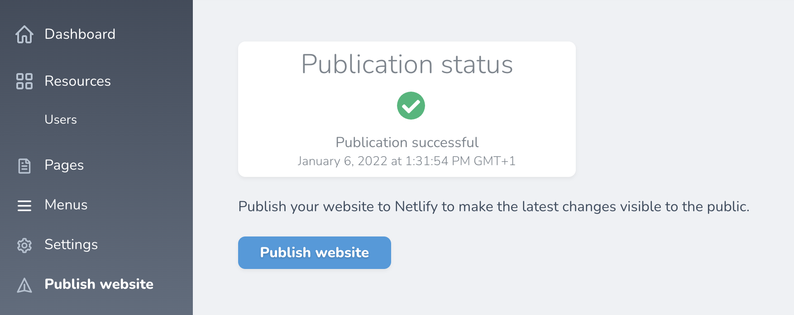

# # Nova publish

<!-- Header & Preview Image -->
<h1 align="center">
  
</h1>

<!-- Shields -->

<!-- Description -->

> Adds a publish button to Nova to deploy your website to Netlify

## Table of Contents

- [Table of Contents](#table-of-contents)
- [Requirements](#requirements)
- [Installation](#installation)
- [Card](#card)

## Requirements

[Return To Top](#nova-publish)

- PHP 7.1
- A Netlify account

## Installation

[Return To Top](#nova-publish)

Install package

```shell script
composer require grrr/nova-netlify-deploy
```

Load the tool by adding it to `NovaServiceProvider.php`

```php
use Grrr\NetlifyDeploy\NetlifyDeployTool;

...

    /**
     * Get the tools that should be listed in the Nova sidebar.
     *
     * @return array<Tool>
     */
    public function tools()
    {
        return [new NetlifyDeployTool()];
    }

...
```

Publish configuration

```shell
php artisan vendor:publish --provider="Grrr\NetlifyDeploy\NetlifyDeployServiceProvider"
```

Add your Netlify credentials to the config file. You can use environment variables for this:

- `NETLIFY_ACCESS_TOKEN`  
  Used to connect with the Netlify API.  
  Create a new token here: https://app.netlify.com/user/applications/personal
- `NETLIFY_SITE_ID`  
  This is the site you wish to deploy from the CMS.  
  You can find this under _Site Settings_, listed under _Site information_ as _API ID_.

## Card

If you want, you can use the card provided by this package to show the deploy status on your Nova dashboard.  
Include the card in the `cards` array of your `NovaServiceProvider`:

```php
use Grrr\NetlifyDeploy\NetlifyDeployCard;

protected function cards()
{
    return [new NetlifyDeployCard()];
}
```
